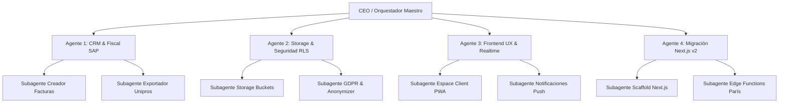

# 🚀 DOCUMENTO MAESTRO DE ORQUESTACIÓN Y TRASPASO — PINO ESPACES VERTS

> **Fecha:** 16 de Septiembre de 2026  
> **Proyecto:** Pino Espaces Verts (v1 PWA Live + Transición v2)  
> **Repositorio:** `https://github.com/jomstudiovzla/pinopage` | Rama: `main`  
> **URL Producción:** `https://jomstudiovzla.github.io/pinopage/`  
> **Último Commit:** `251375d` (Sincronización tiempo real + contadores dinámicos + facturas Firebase)  

---

## 1. ESTADO ACTUAL DEL SISTEMA (¿Qué quedó 100% resuelto y operativo?)

1. **Gestión de Devis y Leads en Vivo**:
   - Todo presupuesto solicitado desde la web se almacena de inmediato en Firebase Realtime Database (`/leads`) y se respalda localmente.
   - El administrador (Andrés Pino) visualiza, filtra y responde presupuestos desde su panel (`#adm-content-leads`).
2. **Envío Silencioso de Devis (Zero Popups Molestos)**:
   - Al hacer clic en *"Enregistrer & Envoyer le Devis au Client"*, el sistema ejecuta un doble despacho en segundo plano:
     - **Copia de Auditoría**: Enviada silenciosamente a `pino.spacesverts@gmail.com` vía Web3Forms.
     - **Correo Formal al Cliente**: Despachado directamente a la bandeja del cliente con desglose fiscal (Crédito de impuesto 50% URSSAF/Unipros, neto a pagar, fecha estimada y duración) vía FormSubmit.
     - Se eliminaron las ventanas emergentes de Gmail (`window.open`), chimes ruidosos y banners flotantes invasivos.
3. **Portal del Cliente Dinámico y Sincronizado en Tiempo Real**:
   - Se corrigió el error del contador que mostraba *"0 Demande(s)"* teniendo cotizaciones activas: ahora refleja la cantidad exacta y el estado dinámico (`X proposition(s) chiffrée(s) reçue(s)`).
   - El contador de facturas se actualiza en vivo con los trabajos finalizados.
   - Se implementaron listeners duales en `assets/js/pino-db.js`: `listenClientNotifications` y `listenClientQuotes`, permitiendo que el cliente vea los cambios de estado y las respuestas de Andrés **en tiempo real sin recargar la página**.
4. **Pestaña de Facturas en Admin Dinamizada**:
   - Se erradicaron los datos estáticos de prueba (Sophie Dupont / Marc Dubois).
   - Se implementó `renderAdminFactures()` enlazado a Firebase RTDB y Supabase (`/jobs`), calculando automáticamente el crédito fiscal SAP del 50% y el neto del cliente.
5. **Autenticación e Identidad**:
   - Detección automática del rol Administrador para `pino.spacesverts@gmail.com` y `pino.espacesverts@gmail.com`.
   - Google Auth operativo para clientes particulares.

---

## 2. QUÉ FALTA POR HACER (Roadmap de Pendientes)

1. **Bucket de Almacenamiento Seguro (Supabase Storage)**:
   - Crear y cablear los buckets `invoices` y `dossiers` con URLs firmadas con expiración de 60 segundos para descargas privadas de comprobantes fiscales Unipros (Attestation Fiscale SAP).
2. **Migración Definitiva de Leads Históricos**:
   - Script para sincronizar leads antiguos de LocalStorage y Firebase hacia las tablas relacionales de Supabase Postgres (`docs/sql/001_initial_schema.sql`).
3. **Automatización de Factura Unipros**:
   - Actualmente el botón *"Nouvelle Facture"* muestra un aviso. Debe abrir un modal que permita convertir un *Lead* aceptado en una *Factura* formal con número correlativo `#FAC-2026-XXX`.
4. **Hito 2 — Arquitectura Next.js 15 (v2)**:
   - Transicionar de la SPA estática actual `index.html` hacia el framework Next.js 15 en `/app`, manteniendo la paleta verde/crema (`#f2f6f0` / `#1e5138`), cero tema oscuro, y server components para SEO.
5. **Consentimiento CNIL Estricto**:
   - Banner de cookies con botones de rechazo explícito antes de inyectar scripts de analítica.

---

## 3. QUÉ SE NECESITA (Credenciales, Accesos y Herramientas)

- **Supabase (Región `eu-west-3` París)**:
  - `SUPABASE_URL` y `SUPABASE_ANON_KEY` verificadas en `assets/js/supabase-config.js`.
  - Acceso al dashboard para activar Storage (`invoices`) con RLS restrictivo `TO authenticated`.
- **Firebase Realtime Database (Producción Actual)**:
  - Base de datos en `pagepino-e8e97-default-rtdb.europe-west1.firebasedatabase.app`.
  - Reglas de lectura y escritura ya desplegadas en `database.rules.json`.
- **Servicios de Envío de Correo**:
  - Llave Web3Forms activa (`646876c1-a20d-48d6-953e-8c3b7a5a4c9b`).
  - Endpoint FormSubmit enlazado al correo del cliente.
- **Node.js & Gestor de Paquetes**:
  - `pnpm` como gestor de paquetes obligatorio para la fase Next.js.

---

## 4. ARQUITECTURA DE ENJAMBRE: AGENTES Y SUBAGENTES REQUERIDOS

Para culminar la plataforma sin colisiones de código ni pérdida de contexto, se orquesta un enjambre de 4 agentes especializados:



### Roles y Misiones de los Agentes:

1. **Agente 1 — Especialista CRM, Facturación y Unipros (Backend/Lógica)**:
   - *Misión*: Implementar el modal de creación de facturas manuales y automáticas a partir de un Lead.
   - *Subagentes*:
     - `Subagente-Facturador`: Generador de correlativos `#FAC-2026-XXX` y cálculo del 50% Urssaf.
     - `Subagente-Exportador`: Generación de reportes CSV/PDF para contabilidad francesa y Unipros.
2. **Agente 2 — Especialista Seguridad, Supabase RLS y Storage (Infra)**:
   - *Misión*: Provisionar buckets de Storage (`invoices`, `dossiers`) con políticas RLS donde solo el cliente dueño y el admin puedan acceder vía URL firmada de 60 segundos.
   - *Subagentes*:
     - `Subagente-Storage`: Configuración de políticas de buckets y subida de PDFs.
     - `Subagente-RGPD`: Procedimiento de derecho al olvido (anonimización de PII manteniendo facturas 10 años por ley contable francesa).
3. **Agente 3 — Especialista UI/UX y Experiencia de Cliente (Frontend)**:
   - *Misión*: Refinar la interacción del Espace Client, validación de ofertas en 1-clic y vista mobile responsiva sin elementos desproporcionados.
   - *Subagentes*:
     - `Subagente-ClientPortal`: Ajuste de espaciados, tarjetas de devis y descarga de PDF.
     - `Subagente-PWA`: Configuración de Service Worker y caché sin conexión.
4. **Agente 4 — Especialista de Migración a Next.js 15 (Hito 2-6)**:
   - *Misión*: Crear la estructura v2 en Next.js App Router, migrando las secciones estáticas sin romper la v1 live hasta la fecha de relevo oficial.

---

## 5. JERARQUÍA DE TAREAS PRIORIZADAS

### 🔴 TAREAS PRINCIPALES (Prioridad 1 — Críticas / Inmediatas)
1. **Modal de Facturación Real en Admin**:
   - Reemplazar el `alert()` del botón *"Nouvelle Facture"* por un modal funcional con formulario: Cliente, Monto TTC, Servicio, Tipo (Unipros SAP / Directo B2B).
   - Guardar en Firebase RTDB `/jobs` y reflejar de inmediato en la tabla de facturas.
2. **Aceptación de Devis en 1-Clic por el Cliente**:
   - Agregar botón en la tarjeta de propuesta del cliente: *"Accepter cette proposition"*.
   - Al pulsar, actualizar el estado a `'Devis accepté'` y notificar automáticamente al panel de Andrés Pino.
3. **Persistencia y Validación de Supabase Storage para Facturas PDF**:
   - Configurar la subida del PDF oficial generado a Supabase Storage con enlace seguro para el cliente.

### 🟡 TAREAS SECUNDARIAS (Prioridad 2 — Negocio, Conversión y UX)
1. **Espaciado y Armonización Visual del CRM**:
   - Corregir en pantallas medianas y móviles las fuentes o tarjetas que se perciban desproporcionadas (micro-fuentes vs elementos sobredimensionados).
2. **Filtros Rápidos en el Portal de Andrés**:
   - Filtro por estado en la pestaña de Leads: *Nouveau*, *Devis envoyé*, *Accepté*, *Terminé*.
3. **Banner de Cookies Conforme a la CNIL**:
   - Componente modular de cookies que bloquee analíticas antes de la autorización expresa del usuario.

### 🟢 TAREAS TERCIARIAS (Prioridad 3 — Escala, Next.js y Cierre de Hitos)
1. **Scaffolding de Next.js 15 (Hito 2)**:
   - Inicializar `v2` en el repositorio usando `pnpm`, Typescript y Tailwind CSS conservando los tokens de Pino.
2. **Edge Functions en Región `eu-west-3` (París)**:
   - Reemplazar Web3Forms y FormSubmit por Edge Functions dedicadas de Supabase con DPA europeo.
3. **Depuración de Cuenta y Anonimización RGPD**:
   - Función para eliminar cuenta de cliente particular: anonimiza nombre y correo, preservando registros contables por 10 años.

---

## 6. PROMPT MAESTRO PARA COPIAR Y PEGAR (Iniciar Nuevo Turno o Agente)

Copia el siguiente bloque de texto en el próximo agente (Grok CLI, Terminal agy, Claude Code o nueva sesión de Antigravity):

```text
Eres el Agente de Desarrollo de JOM Studio a cargo del proyecto Pino Espaces Verts (https://github.com/jomstudiovzla/pinopage).
Lee atentamente `CURRENT_STATE.md`, `.context_sync.json`, `ORQUESTACION_MAESTRA.md` y `AGENTS.md`.

ESTADO ACTUAL:
- Commit reciente: 251375d.
- Sistema de devis, envíos silenciosos por correo (Web3Forms/FormSubmit), contadores dinámicos del Espace Client y renderizado de facturas en Firebase RTDB ya están 100% operativos.

TU OBJETIVO EN ESTE TURNO:
Ejecutar la Tarea Principal P1: Implementar el Modal de Creación de Factura en el Admin (reemplazando el alert del botón 'Nouvelle Facture') y habilitar el botón 'Accepter cette proposition' en el Espace Client con sincronización bidireccional en Firebase.

REGLAS OBLIGATORIAS:
1. Mantener idioma francés en la interfaz de usuario. Paleta clara pino/crema (sin dark mode).
2. Validar sintaxis con `node --check` antes de hacer commit.
3. Al finalizar, hacer commit con atribución 'Co-Authored-By: Grok 4.6 <noreply@x.ai>' y push a main.
4. Actualizar atómicamente `.context_sync.json` y `CURRENT_STATE.md`.
```
