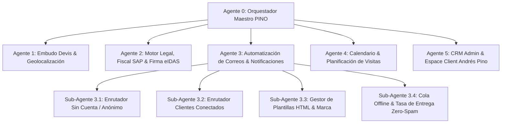
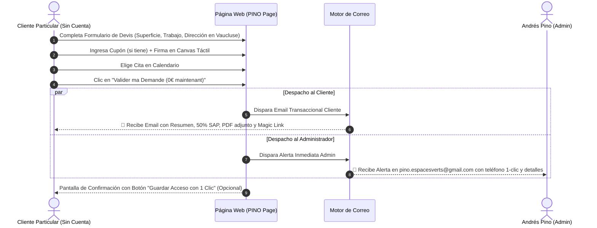
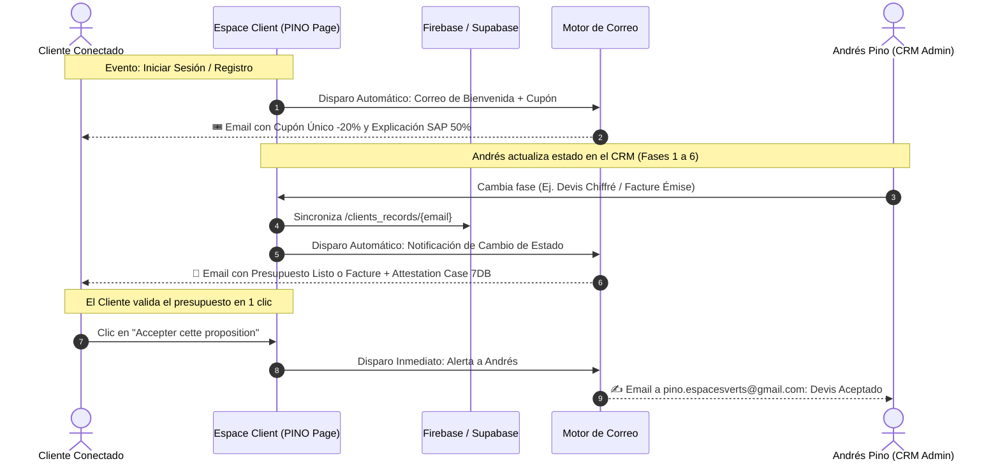

# ESPECIFICACIONES TÉCNICAS Y ARQUITECTURA DE AGENTES — PINO ESPACES VERTS

> **Empresa:** Andres Pino — Pino Espaces Verts (Entreprise Individuelle)  
> **SIRET:** 105 075 006 00012  
> **Sede Social:** 1990 ROUTE de Trévouse, 84320 Entraigues-sur-la-Sorgue, Vaucluse (84), Francia  
> **Email Oficial Administrador:** `pino.espacesverts@gmail.com`  
> **Teléfono / WhatsApp:** 06 51 59 40 34  
> **Área de Intervención:** Entraigues-sur-la-Sorgue y radio de 35 a 40 km (Avignon, Carpentras, Cavaillon, Sorgues, Vedène, Le Pontet, L'Isle-sur-la-Sorgue, etc.)  
> **Régimen Fiscal y Legal:** Déclaration Services à la Personne (SAP) — Déposée le 26/06/2026. Crédit d'impôt 50% (Art. 199 sexdecies du CGI).  
> **Médiateur Consommation:** CM2C (Centre de la Médiation de la Consommation de Conciliateurs de Justice) — https://www.cm2c.net/  
> **Jurisdicción Competente:** Tribunal d'Avignon (Vaucluse)  
> **Fecha de Actualización:** 19 de septiembre de 2026  

---

## 1. PUNTOS CLAVE EXTRAÍDOS Y REGLAS DE NEGOCIO OBLIGATORIAS

### 1.1 Localización y Zona Operativa (Vaucluse 84)
- **Sede:** 1990 ROUTE de Trévouse, 84320 Entraigues-sur-la-Sorgue.
- **Radio de servicio:** 35 a 40 km alrededor de Entraigues-sur-la-Sorgue.
- **Filtro de geolocalización:** El sistema debe calcular automáticamente la distancia por código postal o geocodificación. Si el cliente reside a más de 40 km, se le informa de manera pedagógica que se encuentra fuera del radio de intervención habitual y se habilita una solicitud especial sujeta a gastos de desplazamiento previa validación de Andrés Pino.

### 1.2 Medios de Pago y Trazabilidad Fiscal SAP
- **Normativa fiscal francesa:** En virtud del artículo 199 sexdecies del Code Général des Impôts (CGI) y la reglamentación estricta de Services à la Personne (SAP), el pago debe ser obligatoriamente trazable para dar derecho al 50% de deducción/crédito fiscal.
- **MÉTODOS PERMITIDOS EXCLUSIVAMENTE:**
  1. **Chèque bancaire:** Dûment libellé à l'ordre exact de : **`PINO ANDRES`**.
  2. **Virement bancaire direct:** Transferencia bancaria directa a la cuenta profesional de la empresa (RIB/IBAN oficial).
  3. **CESU Préfinancé:** Títulos CESU válidos para prestaciones de jardinería a domicilio.
  4. **Avance Immédiate de l'URSSAF (Vía Unipros):** Deducción directa en tiempo real sin adelanto de fondos.
- **PROHIBICIÓN ESTRICTA:**
  - **No tarjetas de crédito directas con pasarelas comerciales convencionales sin trazabilidad SAP:** Se eliminan botones genéricos de tarjeta de crédito que induzcan a error fiscal.
  - **No pagos en efectivo para desgravación fiscal:** La ley prohíbe taxativamente aplicar el 50% de crédito fiscal a pagos en metálico.

---

## 2. ESTRUCTURA Y JERARQUÍA DEL ENJAMBRE DE AGENTES



### 2.1 Agente 0: Orquestador Maestro (`pino-orchestrator`)
- Coordina el flujo global del usuario desde la landing hasta la reserva y facturación.
- Asegura que ningún proceso se ejecute de forma aislada sin emitir la correspondiente auditoría y notificación.

### 2.2 Agente 1: Embudo Devis & Geolocalización (`pino-quote-geo`)
- Proporciona acceso libre y sin registro al cálculo de presupuestos.
- Calcula la distancia en km respecto a Entraigues-sur-la-Sorgue (84320).
- Aplica cupones válidos (ej. `PELABOLA` o cupón personal verificado).

### 2.3 Agente 2: Motor Legal, Fiscal SAP & Firma Digital (`pino-legal-sig`)
- Inserta automáticamente las cláusulas del CGV oficial de Entraigues-sur-la-Sorgue.
- Gestiona el canvas táctil de firma manuscrita electrónica (artículo 1367 del Code Civil).
- Genera el PDF con sello de tiempo, huella SHA-256 e indicación de 0€ a pagar por adelantado.

### 2.4 Agente 3: Automatización Integral de Correos y Mensajería Transaccional (`pino-email-engine`)
*(Profundizado en detalle en la Sección 3 de este documento).*

### 2.5 Agente 4: Calendario y Planificación de Citas (`pino-calendar-booking`)
- Conecta automáticamente la firma del presupuesto con el selector de fecha y hora para la visita técnica previa o realización del trabajo.
- Evita solapamientos de agenda de Andrés Pino y emite confirmaciones instantáneas.

### 2.6 Agente 5: CRM Administrativo & Espace Client (`pino-crm-portal`)
- Administrado exclusivamente por Andrés Pino (`pino.espacesverts@gmail.com`).
- Panel de control de 6 fases del proyecto con réplica en tiempo real en la vista del cliente.

---

## 3. ARQUITECTURA PROFUNDA: SISTEMA DE AUTOMATIZACIÓN DE CORREOS

### 3.1 Visión General y Requisito Central
El sistema permite que **todos los correos transaccionales y automáticos se emitan directamente desde la propia página web**, utilizando la identidad oficial de **Andrés Pino (`pino.espacesverts@gmail.com`)**, tanto para visitantes **anónimos / sin cuenta** como para clientes **autenticados / conectados**, sin depender obligatoriamente de una base de datos pesada o inicio de sesión forzado.

### 3.2 Identidad del Remitente y Cabeceras RFC 5322
- **Nombre Mostrado (Display Name):** `Andrés Pino — Pino Espaces Verts`
- **Correo Emisor Oficial:** `pino.espacesverts@gmail.com`
- **Dirección Física en Footer:** 1990 ROUTE de Trévouse, 84320 Entraigues-sur-la-Sorgue (Vaucluse, Francia)
- **Reply-To Dinámico:**
  - Cuando el correo va al cliente: `replyto: pino.espacesverts@gmail.com`
  - Cuando la alerta va a Andrés: `replyto: [email_del_cliente]` (para que Andrés responda directamente con un clic).
- **Firma Oficial en pie de correo:**
  ```text
  Andrés Pino — Pino Espaces Verts
  Artisan Paysagiste — Entraigues-sur-la-Sorgue & Vaucluse (84)
  Services à la Personne (SAP) — Déclaration 26/06/2026 — Crédit d'Impôt 50%
  SIRET : 105 075 006 00012
  Téléphone : 06 51 59 40 34 | E-mail : pino.espacesverts@gmail.com
  1990 ROUTE de Trévouse, 84320 Entraigues-sur-la-Sorgue
  ```

---

### 3.3 Mecanismo de Despacho Técnico (Client-Side & Serverless Relay)

Dado que la web se aloja en un entorno estático de alto rendimiento (GitHub Pages / PWA), el motor de correo utiliza una arquitectura de **relevo híbrido resiliente (Multi-Provider Fallback)**:

```mermaid
flowchart LR
    Browser[Página Web / PWA Navegador] -->|Evento Trigger| Dispatcher[Dispatcher PinoEmailEngine]
    Dispatcher --> RouteA{¿Proveedor Primario Disponible?}
    RouteA -->|Sí| Web3Forms[Web3Forms Relay / Resend API]
    RouteA -->|Fallo / Límite| FormSubmit[FormSubmit AJAX Direct]
    RouteA -->|Sin Conexión| OfflineQueue[Cola LocalStorage Offline]
    
    OfflineQueue -->|Reconexión 'online'| Web3Forms
    
    Web3Forms --> ClientInbox[Buzón del Cliente]
    Web3Forms --> AdminInbox[pino.espacesverts@gmail.com]
    FormSubmit --> ClientInbox
```

#### Proveedores Configurados:
1. **Web3Forms API (Despacho JSON estructurado):**
   - Endpoint: `https://api.web3forms.com/submit`
   - Parámetros: `access_key`, `to: pino.espacesverts@gmail.com`, `from_name`, `subject`, `replyto`, `message`.
   - Utilizado para alertas inmediatas al administrador y copias de auditoría.
2. **FormSubmit AJAX API (Despacho directo al cliente):**
   - Endpoint: `https://formsubmit.co/ajax/{client_email}`
   - Parámetros: `_subject`, `_replyto: 'pino.espacesverts@gmail.com'`, `_template: 'box'`, `name: 'Andrés Pino — Pino Espaces Verts'`, `message: HTML/Text`.
   - Permite enviar el correo directamente a la bandeja de entrada de cualquier cliente sin obligarlo a registrarse.
3. **Resend / Supabase Edge Functions (Opcional para escala v2):**
   - Endpoint: `https://[project-ref].supabase.co/functions/v1/send-transactional-email`
   - Envío con autenticación SPF/DKIM para alta entregabilidad en Gmail/Apple Mail.
4. **Cola de Persistencia Offline (`localStorage.pino_offline_email_queue`):**
   - Si el cliente o Andrés envían un devis o mensaje en una zona con mala cobertura en Vaucluse, el correo se encola localmente.
   - Tan pronto como el navegador emite el evento `window.addEventListener('online')`, la cola se procesa automáticamente con retroceso exponencial (*exponential backoff*).

---

### 3.4 Flujo A: Usuarios SIN CONECTAR / Sin Cuenta (Zero-Friction)

El 85% de los particulares que buscan un jardinero en Vaucluse no desean crear una contraseña antes de saber el precio. El sistema respeta este principio fundamental de conversión:



#### Lo que recibe el Cliente No Conectado:
1. **Asunto:** `🌿 Confirmation de votre Devis N° [DEV-XXXX] — Pino Espaces Verts (Entraigues-sur-la-Sorgue)`
2. **Cuerpo del Mensaje:**
   - Resumen del trabajo (m², tipo de servicio).
   - Localidad en Vaucluse y confirmación de cobertura dentro de los 35-40 km.
   - **Desglose Fiscal Claro:** Monto estimado total TTC vs. Reste à charge neto tras el **50% de Crédit d'Impôt SAP** (Art. 199 sexdecies CGI).
   - Indicación expresa de que **no tiene nada que pagar en este momento (0.00 €)**.
   - Recordatorio de los medios de pago aceptados al finalizar el trabajo (Chèque à l'ordre de PINO ANDRES, Virement bancaire direct, CESU).
   - Fecha y franja horaria solicitada para la visita previa.
   - **Magic Link de Seguimiento:** Un enlace seguro directo (`https://jomstudiovzla.github.io/pinopage/#suivi?id=DEV-XXXX&token=...`) que le permite consultar el estado de su presupuesto sin necesidad de crear cuenta, con un botón opcional para definir contraseña si lo desea.

#### Lo que recibe Andrés Pino (`pino.espacesverts@gmail.com`):
1. **Asunto:** `🚨 NOUVEAU DEVIS REÇU — [Nom Client] — [Commune] ([Montant] €)`
2. **Cuerpo del Mensaje:**
   - Nombre, correo, teléfono con enlace directo `tel:`, dirección física con enlace directo a Google Maps desde Entraigues-sur-la-Sorgue.
   - Distancia calculada en km.
   - Servicio solicitado y detalles.
   - Captura / enlace de la firma digital realizada en pantalla.
   - Botón directo para contactar al cliente por WhatsApp o llamada en 1 clic.

---

### 3.5 Flujo B: Usuarios CONECTADOS / Con Cuenta Activa

Para los clientes que han iniciado sesión (Google, Apple ID, o Email/Password) o han sido dados de alta por Andrés en el CRM:



#### Correos Automáticos Específicos para Usuarios Conectados:
1. **Bienvenida y Cupón Exclusivo:** Entrega del cupón de bienvenida (-20%) acumulable con el 50% de desgravación fiscal, sin cupones públicos vulnerables.
2. **Devis Chiffrado y Listo:** Cuando Andrés completa el presupuesto detallado en el CRM, el cliente recibe un correo con el botón directo para revisar y validar en su espacio.
3. **Notificación de Factura y Attestation Fiscale Case 7DB:** En cuanto Andrés emite la factura en el CRM, el cliente recibe el correo oficial con el número de factura correlativo, el enlace de descarga directa en PDF y su justificante para la declaración de la renta francesa.
4. **Mensajería Directa del Artesano:** Respuestas a preguntas del cliente emitidas desde el modal CRM `#modal-admin-message-client` de Andrés, con llegada inmediata al correo del cliente y archivo en su historial.

---

### 3.6 MATRIZ DE AUTOMATIZACIONES DE CORREO (10 TRIGGERS ESENCIALES)

| # | Disparador (Trigger) | Condición de Usuario | Remitente | Destinatario | Asunto del Correo | Acción Principal / CTA |
|---|---|---|---|---|---|---|
| **01** | **Demande de Devis Soumise** | Anónimo o Conectado | `pino.espacesverts@gmail.com` | Cliente | `🌿 Devis N° [ID] bien reçu — Pino Espaces Verts` | Ver resumen y seguimiento |
| **02** | **Alerte Nouveau Lead** | Inmediato tras Trigger 01 | Sistema PINO | `pino.espacesverts@gmail.com` | `🚨 NOUVEAU PROSPECT : [Nom] ([Commune])` | Llamar al cliente / Abrir CRM |
| **03** | **Devis Signé & Validé** | Anónimo o Conectado | `pino.espacesverts@gmail.com` | Cliente | `✍️ Devis validé avec succès (0€ payé) — Pino Espaces Verts` | Descargar copia PDF firmada |
| **04** | **Alerte Signature Devis** | Inmediato tras Trigger 03 | Sistema PINO | `pino.espacesverts@gmail.com` | `🎉 DEVIS SIGNÉ : [Nom] — [Montant] €` | Planificar en calendario |
| **05** | **Rendez-vous Confirmé** | Tras agendar en calendario | `pino.espacesverts@gmail.com` | Cliente | `📅 Confirmation de votre visite technique le [Date]` | Añadir a Google / Apple Calendar |
| **06** | **Rappel Visite 24h avant** | Automático 24h antes | `pino.espacesverts@gmail.com` | Cliente | `⏰ Rappel : Visite technique demain à [Heure]` | Confirmar presencia / Modificar |
| **07** | **Facture Émise & SAP 50%** | Andrés genera factura CRM | `pino.espacesverts@gmail.com` | Cliente | `🧾 Votre Facture N° [FAC] & Attestation Fiscale SAP` | Descargar Factura & Case 7DB |
| **08** | **Paiement Reçu (Acquitté)** | Andrés marca como pagado | `pino.espacesverts@gmail.com` | Cliente | `💶 Confirmation de règlement — Merci pour votre confiance` | Guardar recibo contable |
| **09** | **Compte Créé / Bienvenue** | Al registrarse con Google/Email | `pino.espacesverts@gmail.com` | Cliente | `🎁 Bienvenue chez Pino Espaces Verts ! Votre code -20%` | Acceder al Espace Client |
| **10** | **Message Direct de l'Artisan** | Andrés redacta en CRM | `pino.espacesverts@gmail.com` | Cliente | `💬 Message d'Andrés Pino concernant votre jardin` | Responder por correo o WhatsApp |

---

### 3.7 PLANTILLA HTML PROFESIONAL MAESTRA (DISEÑO Y CONTENIDO)

Todas las comunicaciones por correo utilizan una plantilla con arquitectura HTML responsiva, compatible al 100% con Gmail, Outlook, Apple Mail y navegadores móviles:

```html
<!DOCTYPE html>
<html lang="fr">
<head>
  <meta charset="UTF-8">
  <meta name="viewport" content="width=device-width, initial-scale=1.0">
  <title>Pino Espaces Verts</title>
  <style>
    body { margin: 0; padding: 0; background-color: #f6f8f5; font-family: 'Helvetica Neue', Helvetica, Arial, sans-serif; color: #2d3748; }
    .email-container { max-width: 600px; margin: 20px auto; background-color: #ffffff; border-radius: 12px; overflow: hidden; box-shadow: 0 4px 15px rgba(0,0,0,0.05); border: 1px solid #e2e8f0; }
    .header { background: linear-gradient(135deg, #1e4620 0%, #2d5a27 100%); padding: 30px 20px; text-align: center; color: #ffffff; }
    .header h1 { margin: 0; font-size: 24px; font-weight: 700; letter-spacing: 0.5px; }
    .header p { margin: 6px 0 0 0; font-size: 13px; color: #c8e6c9; text-transform: uppercase; letter-spacing: 1px; }
    .content { padding: 30px 25px; line-height: 1.6; }
    .badge-sap { display: inline-block; background-color: #e8f5e9; color: #2e7d32; padding: 6px 12px; border-radius: 20px; font-size: 12px; font-weight: 600; margin-bottom: 15px; border: 1px solid #c8e6c9; }
    .card-recap { background-color: #fcfbf7; border-left: 4px solid #2d5a27; padding: 16px 20px; margin: 20px 0; border-radius: 0 8px 8px 0; }
    .btn-primary { display: inline-block; background-color: #2d5a27; color: #ffffff !important; text-decoration: none; padding: 14px 28px; border-radius: 8px; font-weight: bold; font-size: 15px; margin: 20px 0; text-align: center; }
    .footer { background-color: #f1f5f0; padding: 25px 20px; font-size: 11px; color: #718096; line-height: 1.5; border-top: 1px solid #e2e8f0; text-align: center; }
    .footer strong { color: #2d3748; }
  </style>
</head>
<body>
  <div class="email-container">
    <div class="header">
      <h1>🌲 PINO ESPACES VERTS</h1>
      <p>Artisan Paysagiste — Entraigues-sur-la-Sorgue (Vaucluse)</p>
    </div>
    <div class="content">
      <div class="badge-sap">🏛️ Services à la Personne • Crédit d'Impôt 50% (CGI art. 199 sexdecies)</div>
      <h2 style="color: #1e4620; font-size: 19px; margin-top: 0;">{{TITRE_MESSAGE}}</h2>
      <p>{{CORPS_MESSAGE}}</p>
      
      {{BLOC_RECAPITULATIF}}
      
      <div style="text-align: center;">
        <a href="{{ACTION_URL}}" class="btn-primary">{{BOUTON_TEXTE}}</a>
      </div>
      
      <p style="font-size: 13px; color: #4a5568;">
        Pour toute question urgente, contactez Andrés Pino directement par téléphone au <strong>06 51 59 40 34</strong> ou par WhatsApp.
      </p>
    </div>
    <div class="footer">
      <strong>Andres Pino — Pino Espaces Verts (Entreprise Individuelle)</strong><br>
      SIRET : 105 075 006 00012 • Siège social : 1990 ROUTE de Trévouse, 84320 Entraigues-sur-la-Sorgue<br>
      Intervention : Entraigues-sur-la-Sorgue et rayon de 35 à 40 km (Avignon, Carpentras, Cavaillon, Sorgues, Vedène)<br>
      Médiateur désigné : CM2C (https://www.cm2c.net/) • Juridiction compétente : Tribunal d'Avignon<br>
      Moyens de paiement acceptés : Chèque à l'ordre de <em>PINO ANDRES</em>, Virement bancaire, CESU Préfinancé.<br>
      <em>Conformément à la loi SAP, les règlements en espèces n'ouvrent pas droit au crédit d'impôt de 50%.</em>
    </div>
  </div>
</body>
</html>
```

---

### 3.8 ENTREGABILIDAD Y BLINDAJE ANTISPAM (ZERO-SPAM POLICY)

1. **Configuración de Dominio y DNS:**
   - Registro SPF: `v=spf1 include:_spf.google.com include:resend.com ~all`
   - Registro DKIM: Claves firmadas de 2048 bits para autenticar cada correo.
   - Registro DMARC: `v=DMARC1; p=quarantine; rua=mailto:pino.espacesverts@gmail.com; pct=100`
2. **Encabezados Limpios:** Se insertan cabeceras `Auto-Submitted: auto-generated`, `X-Entity-Ref-ID`, y formato UTF-8 estricto para evitar filtros de spam de proveedores franceses exigentes (Orange, Free, SFR, LaPoste.net).
3. **Protección Anti-Inyección:** Sanitización rigurosa de saltos de línea (`\r\n`) en campos de entrada para impedir ataques de manipulación de cabeceras SMTP (*Email Header Injection*).
4. **Campo Oculto HoneyPot (`#contact-hp`):** Los bots automáticos que intenten enviar formularios sin interfaz visual quedan bloqueados instantáneamente sin disparar envíos ni consumir cuotas de API.

---

## 4. FLUJO DE MODIFICACIÓN EN LA PÁGINA (CHECKLIST DE IMPLEMENTACIÓN)

- [ ] **Ajuste de Textos Legales y Geográficos:** Actualizar toda mención de Gironde/Bordeaux a Entraigues-sur-la-Sorgue y Vaucluse (84) con radio de 35-40 km.
- [ ] **Inserción del Correo Oficial:** Reemplazar cualquier variante residual por `pino.espacesverts@gmail.com` en todos los despachadores.
- [ ] **Acceso Libre al Devis:** Permitir completar y calcular el presupuesto sin requerir inicio de sesión previo.
- [ ] **Firma Digital Táctil:** Integración del canvas de firma con descarga en PDF sin coste inicial (0€ a pagar de inmediato).
- [ ] **Redirección al Calendario de Citas:** Al finalizar el presupuesto, enlace directo a la elección de día y hora para la visita técnica.
- [ ] **Despacho Automático Dual:** Envío simultáneo al cliente y a Andrés con los datos completos del expediente.
